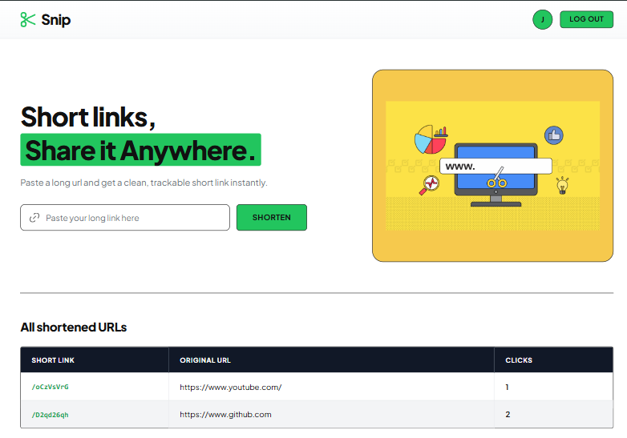
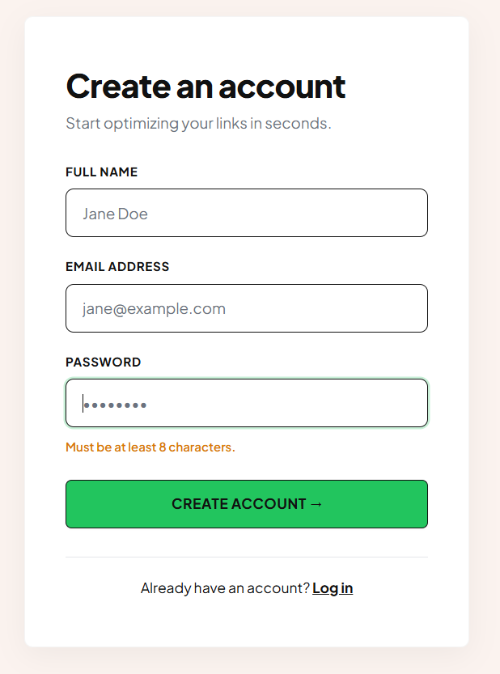
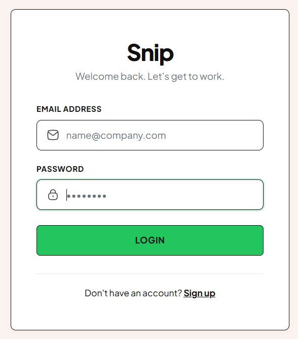

# ✂️ Snip — Modern URL Shortener & Link Analytics

<p align="center">
  
</p>

<p align="center">
  <b>A fast, lightweight, and modern URL shortener built with Node.js, Express, MongoDB, and EJS.</b><br>
  Shorten links, track click analytics in real-time, and manage your links effortlessly.
</p>

<p align="center">
  
  
  
  
  
</p>

---

## 📸 Preview & Screenshots

### 🏠 Home Dashboard
> Shorten URLs, copy generated links with one click, and view your link click statistics.

<p align="center">
  
</p>

---

### 🔐 Authentication

<table align="center" width="100%">
  <tr>
    <td width="50%" align="center">
      <b>Sign Up</b><br>
      
    </td>
    <td width="50%" align="center">
      <b>Log In</b><br>
      
    </td>
  </tr>
</table>

---

## ✨ Features

- ⚡ **Instant URL Shortening**: Generate clean, compact 8-character short links using NanoID.
- 📈 **Click Analytics**: Automatically record timestamps and track total click counts for every visit.
- 🔐 **Secure Authentication**: User sign-up and login powered by JSON Web Tokens (JWT) with HTTP-only cookies.
- 👥 **Role-Based Access Control (RBAC)**:
  - **Normal Users**: Manage and view personal shortened links and click histories.
  - **Admins**: Elevated access to monitor system-wide URLs via `/admin/urls`.
- 📋 **One-Click Copy**: Instant clipboard copying for newly generated short links.
- 🎨 **Bespoke Design System**: Custom Vanilla CSS with CSS custom properties (tokens), responsive layouts, and zero heavy UI frameworks.
- 📱 **Mobile-First Responsiveness**: Tailored layout adaptations across mobile, tablet, and desktop breakpoints.

---

## 🛠️ Tech Stack

| Layer | Technologies |
|---|---|
| **Backend** | [Node.js](https://nodejs.org/), [Express.js](https://expressjs.com/) (v5) |
| **Database** | [MongoDB](https://www.mongodb.com/) with [Mongoose ODM](https://mongoosejs.com/) |
| **Authentication** | [JSON Web Tokens (JWT)](https://jwt.io/), [Cookie-Parser](https://www.npmjs.com/package/cookie-parser) |
| **ID Generation** | [NanoID](https://github.com/ai/nanoid) |
| **View Engine** | [EJS (Embedded JavaScript Templates)](https://ejs.co/) |
| **Frontend Styling** | Plain CSS (CSS Variables, Flexbox & CSS Grid) |

---

## 📁 Project Structure

```bash
url-shortener/
├── controllers/          # Request handlers (URL generation, user auth, analytics)
│   ├── url.js
│   └── user.js
├── middlewares/          # Authentication & RBAC middleware
│   └── auth.js
├── models/               # Mongoose schemas & data models
│   ├── url.js
│   └── user.js
├── routes/               # Express route definitions
│   ├── staticRouter.js   # Page render routes (Home, Login, Signup, Admin)
│   ├── url.js            # URL shortening & analytics endpoints
│   └── user.js           # Auth routes (Signup, Login, Logout)
├── service/              # Token generation and verification services
│   └── auth.js
├── views/                # EJS template views
│   ├── partials/
│   │   └── navbar.ejs    # Reusable header navigation
│   ├── home.ejs          # Dashboard & shortened URLs table
│   ├── login.ejs         # Login page
│   └── signup.ejs        # Sign up page
├── public/               # Static assets served by Express
│   ├── css/
│   │   ├── base.css      # Design tokens, typography & reset
│   │   ├── components.css# Buttons, inputs, illustration & table
│   │   ├── home.css      # Home layout & responsive grid
│   │   └── auth.css      # Sign Up & Login card styles
│   └── images/           # SVG icons & illustrations
├── readme/               # README screenshot assets
│   ├── home.png
│   ├── login.png
│   └── signup.png
├── db.js                 # MongoDB connection setup
├── design.md             # UI design & design system specification
├── index.js              # Application entry point & server setup
├── package.json          # Project dependencies & scripts
└── README.md             # Project documentation
```

---

## 🚀 Getting Started

### Prerequisites

Ensure you have the following installed on your machine:
- [Node.js](https://nodejs.org/) (v16.0.0 or higher)
- [npm](https://www.npmjs.com/) (Node Package Manager)
- [MongoDB](https://www.mongodb.com/try/download/community) running locally on `mongodb://127.0.0.1:27017` (or a MongoDB Atlas connection string)

---

### Installation & Setup

1. **Clone the Repository**
   ```bash
   git clone https://github.com/Anuj-135/URL_Shortener.git
   cd URL_Shortener
   ```

2. **Install Dependencies**
   ```bash
   npm install
   ```

3. **Configure Database Connection**
   - By default, the application connects to local MongoDB in `index.js`:
     ```javascript
     connectMongoDb("mongodb://127.0.0.1:27017/short-url");
     ```
   - Make sure your MongoDB service is running:
     ```bash
     # Windows (Command Prompt / PowerShell)
     net start MongoDB

     # macOS / Linux
     brew services start mongodb-community
     ```

4. **Start the Development Server**
   ```bash
   npm start
   ```

5. **Open in Browser**
   - Visit [http://localhost:8001](http://localhost:8001)

---

## 🧭 Routes & Endpoints

### 🖥️ Page Views
| Method | Route | Access | Description |
|---|---|---|---|
| `GET` | `/` | User / Admin | Home dashboard with URL shortener form and link history |
| `GET` | `/login` | Public | User login page |
| `GET` | `/signup` | Public | User registration page |
| `GET` | `/admin/urls` | Admin Only | Administrative overview of all platform URLs |

### ⚡ URL & Redirection
| Method | Route | Description |
|---|---|---|
| `POST` | `/url` | Generates a new short URL for the authenticated user |
| `GET` | `/:shortId` | Redirects to original URL and increments visit analytics |
| `GET` | `/url/analytics/:shortId` | Returns JSON object with click counts and visit timestamps |

### 🔑 Authentication
| Method | Route | Description |
|---|---|---|
| `POST` | `/user` | Creates a new user account and redirects to login |
| `POST` | `/user/login` | Authenticates credentials and sets JWT cookie |
| `GET` | `/user/logout` | Clears authentication cookie and redirects to `/login` |

---

## 🎨 Design System

The UI was crafted from scratch based on modern geometric design principles:

- **Primary Brand Color**: `#22C55E` (Emerald Green)
- **Backgrounds**: `#FFFFFF` (Home) & `#FBF3EF` (Blush / Auth)
- **Illustration Background**: `#F6C94D` (Warm Amber)
- **Typography**: [Plus Jakarta Sans](https://fonts.google.com/specimen/Plus+Jakarta+Sans) & [Inter](https://fonts.google.com/specimen/Inter)
- **Responsiveness**:
  - `Desktop (> 1024px)`: 2-column hero grid with side-by-side URL input.
  - `Tablet (640px – 1024px)`: Fluid container with adaptive padding.
  - `Mobile (< 640px)`: Single-column stack, full-width inputs/buttons, horizontal scrolling data table.

---

## 🤝 Contributing

Contributions, issues, and feature requests are welcome! Feel free to check the [issues page](https://github.com/Anuj-135/URL_Shortener/issues).

1. Fork the Project
2. Create your Feature Branch (`git checkout -b feature/AmazingFeature`)
3. Commit your Changes (`git commit -m 'Add some AmazingFeature'`)
4. Push to the Branch (`git push origin feature/AmazingFeature`)
5. Open a Pull Request

---

## 📄 License

This project is open source and available under the [ISC License](LICENSE).
